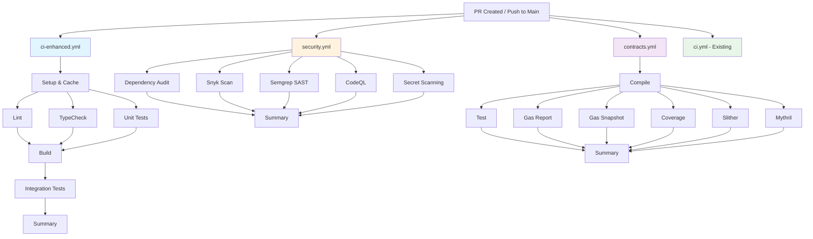

# Workflow Architecture

## Workflow Execution Flow



## Job Dependencies

### Enhanced CI Pipeline

```
setup
  ├─ lint ────────┐
  ├─ typecheck ───┤
  └─ test ────────┴─ build ─ integration ─ summary
```

### Security Scanning

```
All jobs run in parallel
  ├─ dependency-audit
  ├─ snyk-scan
  ├─ semgrep-scan
  ├─ codeql-analysis
  ├─ secret-scanning
  ├─ dependency-review (PR only)
  └─ security-scorecard (main only)
      └─ security-summary
```

### Smart Contract Checks

```
compile
  ├─ test ────────┐
  ├─ gas-report ──┤
  ├─ gas-snapshot ┤
  ├─ coverage ────┤
  ├─ slither ─────┤
  └─ mythril ─────┴─ contract-summary
```

## Trigger Matrix

| Workflow        | Push (main) | Push (develop) | PR   | Schedule   | Manual |
| --------------- | ----------- | -------------- | ---- | ---------- | ------ |
| ci-enhanced.yml | ✅          | ✅             | ✅   | ❌         | ❌     |
| security.yml    | ✅          | ✅             | ✅   | ✅ (daily) | ✅     |
| contracts.yml   | ✅\*        | ✅\*           | ✅\* | ❌         | ✅     |
| ci.yml          | ✅          | ❌             | ✅   | ❌         | ❌     |

\*Only if contract files changed

## Caching Strategy

```
┌─────────────────────────────────────┐
│         Workflow Execution          │
├─────────────────────────────────────┤
│                                     │
│  ┌──────────────────────────────┐  │
│  │    pnpm Store Cache          │  │
│  │  Key: pnpm-lock.yaml hash    │  │
│  │  Shared across all workflows │  │
│  └──────────────────────────────┘  │
│                                     │
│  ┌──────────────────────────────┐  │
│  │    Foundry Build Cache       │  │
│  │  Key: contract source hash   │  │
│  │  Shared across contract jobs │  │
│  └──────────────────────────────┘  │
│                                     │
│  ┌──────────────────────────────┐  │
│  │    Turbo Cache               │  │
│  │  Key: task input hash        │  │
│  │  Per-task caching            │  │
│  └──────────────────────────────┘  │
│                                     │
└─────────────────────────────────────┘
```

## Resource Usage

### Concurrent Workflows

When a PR is created, all workflows run in parallel:

```
Total GitHub Actions Runners: 4 concurrent jobs
├─ Runner 1: ci-enhanced.yml jobs
├─ Runner 2: security.yml jobs
├─ Runner 3: contracts.yml jobs
└─ Runner 4: ci.yml jobs
```

### Estimated Costs (GitHub-hosted runners)

```
Per PR:
├─ ci-enhanced.yml: ~20 min × $0.008/min = $0.16
├─ security.yml:    ~25 min × $0.008/min = $0.20
├─ contracts.yml:   ~30 min × $0.008/min = $0.24
└─ ci.yml:          ~25 min × $0.008/min = $0.20
    Total: ~$0.80 per PR

Monthly estimate (100 PRs): ~$80
```

## Security Pipeline Details

### Vulnerability Detection Flow

```
┌─────────────────────────────────────────────┐
│          Source Code & Dependencies         │
└─────────────┬───────────────────────────────┘
              │
              ├─► npm audit ───► Known vulnerabilities
              │
              ├─► Snyk ────────► CVEs + Code issues
              │
              ├─► Semgrep ─────► OWASP patterns
              │
              ├─► CodeQL ──────► Semantic analysis
              │
              └─► Gitleaks ────► Secrets detection
                  │
                  ▼
              ┌───────────────┐
              │ GitHub        │
              │ Security Tab  │
              │ (SARIF)       │
              └───────────────┘
```

### Security Levels

```
Level 1: Blocking (must pass)
├─ High-severity vulnerabilities in dependencies
├─ Detected secrets in commits
└─ Critical CodeQL findings

Level 2: Warning (review required)
├─ Medium-severity vulnerabilities
├─ Semgrep findings
└─ Snyk code issues

Level 3: Informational (monitor)
├─ Low-severity vulnerabilities
├─ Security scorecard metrics
└─ Best practice recommendations
```

## Contract Security Pipeline

### Analysis Layers

```
Layer 1: Compilation & Testing
├─ Solidity compilation (syntactic)
├─ Unit tests (functional)
└─ Gas profiling (efficiency)

Layer 2: Static Analysis
├─ Slither (fast, comprehensive)
└─ Mythril (deep, slower)

Layer 3: Coverage & Reporting
├─ Code coverage metrics
├─ Gas regression tracking
└─ SARIF security reports
```

### Gas Regression Detection

```
PR Branch
   │
   ├─ forge snapshot ──► .gas-snapshot-pr
   │
   ▼
Base Branch
   │
   ├─ forge snapshot ──► .gas-snapshot-base
   │
   ▼
Compare
   │
   ├─ diff > 5% ─────► ⚠️ Warning
   │
   └─ diff > 10% ────► ❌ Failure
```

## Integration with GitHub Features

### Branch Protection Rules

```yaml
Required Status Checks:
  # From ci-enhanced.yml
  - Lint
  - Type Check
  - Unit Tests
  - Build All Packages

  # From contracts.yml
  - Compile Contracts
  - Run Tests (contracts)

  # From security.yml (optional)
  - Dependency Audit

Require branches to be up to date: true
Require linear history: false
Require deployments to succeed: false
```

### SARIF Uploads

Security findings automatically appear in:

1. **GitHub Security Tab**
   - Code scanning alerts
   - Dependency alerts
   - Secret scanning alerts

2. **Pull Request Comments**
   - Inline annotations
   - Summary comments
   - Diff suggestions

3. **GitHub Advanced Security Dashboard**
   - Trend analysis
   - Severity distribution
   - Remediation tracking

## Failure Scenarios & Recovery

### Scenario 1: Dependency Vulnerability

```
Detection: security.yml → dependency-audit
  │
  ├─ High severity found
  │
  ▼
Action Required:
  1. Review advisory in Security tab
  2. Update dependency: pnpm update <package>
  3. Test locally: pnpm test
  4. Commit fix
  5. Re-run workflows
```

### Scenario 2: Contract Gas Regression

```
Detection: contracts.yml → gas-snapshot
  │
  ├─ >10% increase detected
  │
  ▼
Action Required:
  1. Review gas report artifact
  2. Optimize contract code
  3. Run local test: forge test --gas-report
  4. Adjust tolerance if intentional
  5. Commit optimization
```

### Scenario 3: Slither Findings

```
Detection: contracts.yml → slither
  │
  ├─ High severity finding
  │
  ▼
Action Required:
  1. Review SARIF in Security tab
  2. Analyze finding in code
  3. Fix or document false positive
  4. Update exclusions if needed
  5. Re-run analysis
```

## Monitoring & Observability

### Key Metrics to Track

```
Quality Metrics:
├─ Test Coverage Trend
├─ Lint Error Rate
├─ TypeScript Error Rate
└─ Build Success Rate

Security Metrics:
├─ Open CVEs
├─ Mean Time to Remediate
├─ Security Findings by Severity
└─ Dependency Update Lag

Performance Metrics:
├─ Workflow Duration
├─ Gas Usage Trend
├─ Build Time Trend
└─ Cache Hit Rate
```

### Dashboard Visualization

Recommended tools:

- GitHub Insights (built-in)
- Codecov Dashboard (coverage)
- Snyk Dashboard (vulnerabilities)
- Custom Grafana (if self-hosted runners)

## Maintenance Schedule

### Daily

- Review security scan results
- Check failed workflow notifications

### Weekly

- Review gas usage trends
- Update dependencies with vulnerabilities
- Clean up old artifacts

### Monthly

- Review workflow performance
- Optimize cache strategies
- Update tool versions
- Review and update exclusions

### Quarterly

- Audit security policies
- Review branch protection rules
- Benchmark against industry standards
- Plan workflow improvements

## Best Practices Summary

### DO ✅

1. Run all checks locally before pushing
2. Review security findings promptly
3. Keep dependencies up to date
4. Monitor gas usage trends
5. Write tests for new features
6. Document security exclusions
7. Cache aggressively
8. Use fail-fast strategies

### DON'T ❌

1. Ignore security warnings
2. Skip tests for "minor" changes
3. Hardcode secrets in code
4. Deploy without passing CI
5. Disable security checks
6. Force push to protected branches
7. Commit without running lint
8. Ignore gas regressions

## Emergency Procedures

### Workflow Completely Broken

```bash
# 1. Identify the broken workflow
# 2. Disable it temporarily in GitHub UI
# 3. Create hotfix branch
git checkout -b hotfix/workflow-fix

# 4. Fix and test locally
act -j <job-name>  # Using nektos/act

# 5. Create minimal PR
# 6. Re-enable workflow after merge
```

### Security Tool False Positives

```yaml
# Add to workflow file
slither-args: --exclude <detector>
# Or create .gitleaksignore
# Or create .semgrepignore

# Document reason in comments
```

### Performance Degradation

```bash
# 1. Check workflow insights
# 2. Analyze cache hit rates
# 3. Identify slow jobs

# 4. Optimize by:
- Adding more caching
- Splitting large jobs
- Using matrix parallelization
- Filtering unnecessary triggers
```

## References

- [GitHub Actions Documentation](https://docs.github.com/actions)
- [Foundry Book](https://book.getfoundry.sh/)
- [Slither Documentation](https://github.com/crytic/slither)
- [Snyk Documentation](https://docs.snyk.io/)
- [Semgrep Rules](https://semgrep.dev/explore)
