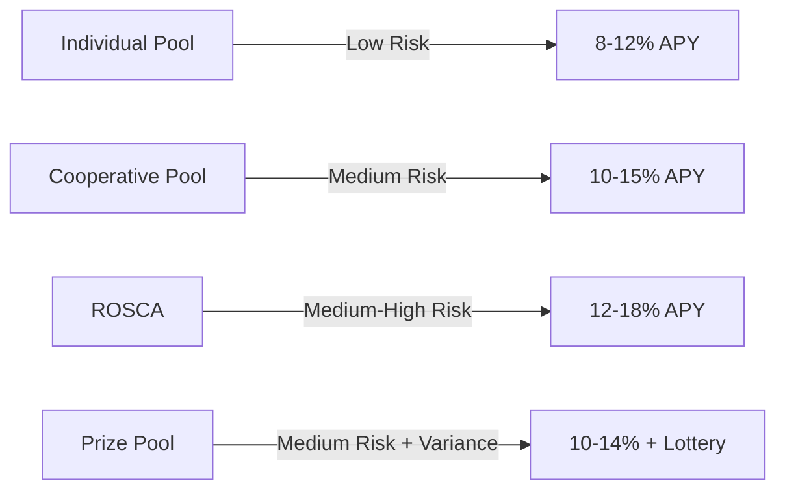

import { Callout } from 'fumadocs-ui/components/callout';
import { Step, Steps } from 'fumadocs-ui/components/steps';

# Multi-Pool Diversification Strategy

Learn how to build a robust, diversified Bitcoin savings portfolio by strategically allocating funds across KhipuVault's different pool types to balance risk, yield, and liquidity.

## Prerequisites

Before starting this tutorial, you should have:

- Completed [First Deposit](/docs/tutorials/beginner/first-deposit) tutorial
- Experience with at least two different pool types
- Understanding of [Individual Pools](/docs/products/individual-savings) and [Cooperative Pools](/docs/products/cooperative-savings)
- At least 0.1 BTC to allocate across multiple pools
- Familiarity with your risk tolerance and savings goals

## What You'll Learn

By the end of this tutorial, you will:

- Understand the risk-return profile of each pool type
- Build a diversified allocation strategy based on your goals
- Calculate optimal position sizes for each pool
- Rebalance your portfolio as market conditions change
- Monitor and adjust your strategy over time
- Handle different scenarios (emergency liquidity, yield maximization, etc.)

<Callout type="info">
  Diversification is key to managing risk while maximizing long-term returns. This tutorial shows you how to build a portfolio that works for your specific situation.
</Callout>

## Understanding Pool Characteristics

### Pool Type Comparison

| Pool Type | Risk Level | Expected APY | Liquidity | Best For |
|-----------|-----------|--------------|-----------|----------|
| Individual Pool | Low | 8-12% | Instant | Emergency funds, conservative savers |
| Cooperative Pool | Medium | 10-15% | 7-day notice | Community building, steady yields |
| ROSCA | Medium-High | 12-18% | Locked periods | Disciplined saving, structured goals |
| Prize Pool | Medium | 10-14% avg | Flexible | Risk takers, lottery enthusiasts |

### Risk-Return Profiles



## Step-by-Step Strategy Building

<Steps>

### Step 1: Define Your Investment Goals

First, determine your primary objectives:

#### Goal Categories

**Conservative (Safety First)**
- Preserve capital with minimal risk
- Steady, predictable returns
- High liquidity for emergencies

**Balanced (Growth with Safety)**
- Moderate yield with controlled risk
- Mix of liquid and locked positions
- Community participation

**Aggressive (Maximum Yield)**
- Highest possible returns
- Willing to lock funds longer
- Comfortable with variance

<Callout type="tip">
  Most users benefit from a balanced approach. Start conservative and gradually shift to more aggressive strategies as you gain experience.
</Callout>

#### Example Goal Setting

```typescript
// Define your goals
const myGoals = {
  totalCapital: 1.0, // BTC
  timeHorizon: "12 months",
  liquidityNeed: "20%", // Need quick access to 20% of funds
  riskTolerance: "Moderate",
  primaryGoal: "Balanced growth with community participation"
}
```

### Step 2: Calculate Your Allocation

Use these recommended allocation models based on your risk profile:

#### Conservative Allocation (Safety First)

```
Individual Pool:     60% (0.60 BTC)
Cooperative Pool:    30% (0.30 BTC)
Prize Pool:          10% (0.10 BTC)
ROSCA:               0%
```

**Characteristics:**
- High liquidity (60% instant access)
- Predictable yields (8-11% blended APY)
- Minimal lockup risk
- Good for emergency fund builders

#### Balanced Allocation (Recommended)

```
Individual Pool:     30% (0.30 BTC)
Cooperative Pool:    40% (0.40 BTC)
ROSCA:               20% (0.20 BTC)
Prize Pool:          10% (0.10 BTC)
```

**Characteristics:**
- Moderate liquidity (30% instant, 40% 7-day notice)
- Strong yields (11-14% blended APY)
- Community engagement
- Good for most users

#### Aggressive Allocation (Maximum Yield)

```
Cooperative Pool:    30% (0.30 BTC)
ROSCA:               50% (0.50 BTC)
Prize Pool:          20% (0.20 BTC)
Individual Pool:     0%
```

**Characteristics:**
- Lower liquidity (mostly locked)
- Highest yields (13-16% blended APY)
- Maximum community participation
- Good for long-term holders

### Step 3: Execute Your Initial Allocation

#### 3.1 Start with Individual Pool (Liquidity Base)

```typescript
// Navigate to Individual Pool
1. Go to dashboard
2. Click "Individual Savings"
3. Deposit your liquidity allocation (e.g., 0.30 BTC for balanced)
4. Enable auto-compounding
```

**Why start here?**
- Provides instant liquidity safety net
- Generates immediate yield
- No lockup risk while you research other pools

#### 3.2 Join or Create Cooperative Pools

```typescript
// For each cooperative pool position
1. Research available pools (reputation, yield, terms)
2. Join 2-3 pools to diversify cooperative exposure
3. Split allocation (e.g., 0.15 + 0.15 + 0.10 BTC)
4. Note withdrawal notice periods
```

**Diversification tips:**
- Different pool sizes (small, medium, large)
- Different withdrawal terms (3-day, 7-day, 14-day)
- Different communities (friends, DAO, public)

#### 3.3 Enter ROSCA (If Applicable)

```typescript
// ROSCA Selection
1. Find ROSCA matching your timeline
2. Verify position availability
3. Commit allocated amount
4. Mark payout dates on calendar
```

**ROSCA considerations:**
- Align ROSCA cycle with your savings goal
- Understand position order implications
- Factor in lockup period

#### 3.4 Enter Prize Pools

```typescript
// Prize Pool Strategy
1. Spread across multiple prize pools
2. Enter different draw cycles
3. Set maximum allocation limit
4. Track potential winnings
```

### Step 4: Set Up Monitoring Systems

#### 4.1 Create a Portfolio Dashboard

Track these key metrics:

```typescript
Portfolio Metrics:
├── Total Value (BTC)
├── Blended APY (%)
├── Yield Generated This Month (BTC)
├── Liquidity Available
│   ├── Instant (Individual Pool)
│   ├── 7-Day Notice (Cooperative)
│   └── Locked (ROSCA)
├── Risk Score (1-10)
└── Rebalancing Signals
```

#### 4.2 Set Up Alerts

Configure notifications for:

- Weekly yield summary
- Rebalancing opportunities (greater than 10% drift)
- New high-yield pool opportunities
- ROSCA payout approaching
- Prize pool drawing results

<Callout type="tip">
  Use KhipuVault's portfolio dashboard to track all metrics in one place. Set up email or Discord notifications for important events.
</Callout>

### Step 5: Implement Rebalancing Rules

#### When to Rebalance

**Quarterly Rebalancing (Recommended)**
- Review portfolio every 3 months
- Rebalance if allocation drifts greater than 15% from target
- Reinvest accumulated yields

**Threshold Rebalancing**
- Rebalance when any position drifts greater than 20%
- More responsive to market changes
- May incur more transaction costs

**Opportunistic Rebalancing**
- New high-yield pool appears (+3% APY vs current)
- Community pool you're in underperforms
- Your goals or risk tolerance changes

#### Rebalancing Process

```typescript
// Quarterly Rebalancing Checklist
1. Calculate current allocation percentages
2. Compare to target allocation
3. Identify over/under-weighted positions
4. Withdraw from over-weighted positions
5. Deposit into under-weighted positions
6. Record transaction costs and new yields
```

**Example Rebalancing:**

```
Target: 30% Individual | 40% Cooperative | 20% ROSCA | 10% Prize
Current: 25% Individual | 35% Cooperative | 30% ROSCA | 10% Prize

Actions:
1. Withdraw 0.05 BTC from ROSCA (when cycle completes)
2. Deposit 0.03 BTC to Individual Pool
3. Deposit 0.02 BTC to Cooperative Pool
```

### Step 6: Advanced Strategies

#### Ladder Strategy (Liquidity Optimization)

Create staggered positions for consistent liquidity:

```
ROSCA Ladder:
├── Position 1: 6-month cycle, payout month 2
├── Position 2: 6-month cycle, payout month 4
└── Position 3: 6-month cycle, payout month 6

Result: Payout every 2 months
```

#### Yield Harvesting Strategy

```typescript
// Monthly Yield Harvesting
1. Track accumulated yields across all pools
2. Once yields reach threshold (e.g., 0.01 BTC):
   a. Withdraw from Individual Pool (instant)
   b. Reallocate to highest-yield pool
   c. Compound returns
3. Repeat monthly
```

#### Seasonal Reallocation

```
High Volatility Periods:
├── Increase Individual Pool (safety)
├── Decrease ROSCA exposure
└── Maintain Prize Pool for upside

Low Volatility Periods:
├── Decrease Individual Pool
├── Increase ROSCA and Cooperative
└── Maximize yield capture
```

</Steps>

## Real-World Examples

### Example 1: Emergency Fund Builder (1.0 BTC)

**Profile:**
- Goal: Build emergency fund while earning yield
- Risk tolerance: Low
- Liquidity need: High (50%+)

**Allocation:**
```
Individual Pool:     0.60 BTC (60%)
Cooperative Pool:    0.30 BTC (30%) - 3-day notice pools only
Prize Pool:          0.10 BTC (10%)

Expected APY: ~10%
Instant Liquidity: 60%
7-Day Liquidity: 90%
```

**Strategy:**
- Keep majority in Individual Pool for instant access
- Use short-notice cooperative pools only
- Small prize pool allocation for upside potential
- Rebalance only if yields drop significantly

### Example 2: Community Builder (2.5 BTC)

**Profile:**
- Goal: Active community participation with strong yields
- Risk tolerance: Moderate
- Liquidity need: Medium (25%)

**Allocation:**
```
Individual Pool:     0.50 BTC (20%)
Cooperative Pools:   1.50 BTC (60%) - split across 4 pools
ROSCA:               0.25 BTC (10%)
Prize Pool:          0.25 BTC (10%)

Expected APY: ~13%
Instant Liquidity: 20%
Active in 4 communities
```

**Strategy:**
- Diversify across multiple cooperative pools
- Participate in community governance
- Use Individual Pool as liquidity buffer
- Reinvest yields into community pools

### Example 3: Yield Maximizer (5.0 BTC)

**Profile:**
- Goal: Maximum returns, long-term horizon
- Risk tolerance: High
- Liquidity need: Low (10%)

**Allocation:**
```
Individual Pool:     0.50 BTC (10%)
Cooperative Pools:   1.50 BTC (30%) - high-yield pools
ROSCA:               2.50 BTC (50%) - multiple cycles
Prize Pool:          0.50 BTC (10%)

Expected APY: ~15%
Instant Liquidity: 10%
Multiple ROSCA positions for regular payouts
```

**Strategy:**
- Ladder ROSCA positions for consistent payouts
- Focus on highest-yield cooperative pools
- Minimal liquidity buffer
- Aggressive rebalancing toward yield

## Performance Tracking

### Key Performance Indicators (KPIs)

Track these metrics monthly:

```typescript
Monthly KPIs:
├── Absolute Returns
│   ├── Total Yield Generated (BTC)
│   ├── Yield Generated (USD)
│   └── YTD Returns (%)
├── Relative Performance
│   ├── Blended APY vs Target
│   ├── Performance vs Individual Pool Only
│   └── Performance vs BTC Holding
├── Risk Metrics
│   ├── Portfolio Volatility
│   ├── Liquidity Ratio
│   └── Concentration Risk (largest position %)
└── Efficiency Metrics
    ├── Rebalancing Costs
    ├── Opportunity Cost (missed yields)
    └── Time Spent Managing
```

### Portfolio Health Scorecard

Rate your portfolio quarterly:

```
✅ Liquidity: Sufficient instant access funds (greater than 20%)
✅ Diversification: No single position greater than 50%
✅ Yield: Meeting or exceeding target APY
✅ Risk: Aligned with your risk tolerance
✅ Rebalancing: Allocations within 15% of targets
✅ Growth: YTD returns on track for annual goal

Score: 6/6 = Excellent | 4-5/6 = Good | less than 4/6 = Needs adjustment
```

## Common Mistakes to Avoid

<Callout type="error">
  **Common Pitfalls:**

  1. **Over-concentration**: Putting greater than 50% in any single pool
  2. **Chasing yield**: Moving funds too frequently for small yield differences
  3. **Ignoring liquidity**: Having less than 15% in liquid positions
  4. **Over-diversification**: Spreading too thin across 10+ pools
  5. **Emotional decisions**: Panicking during market volatility
  6. **Neglecting rebalancing**: Letting allocation drift greater than 25%
  7. **Ignoring fees**: Not factoring in withdrawal and rebalancing costs
</Callout>

## Troubleshooting

### Issue: Can't Access Funds When Needed

**Problem:** Emergency situation but funds are locked in ROSCA

**Solution:**
- Always maintain 20-30% in Individual Pool for emergencies
- Use cooperative pools with less than 7-day notice for bulk of allocation
- Consider emergency withdrawal options (may incur penalties)
- Build true emergency fund outside of yield strategies

### Issue: Underperforming Target APY

**Problem:** Blended APY is 9% but target was 12%

**Solution:**
1. Identify underperforming pools
2. Research higher-yield alternatives
3. Reallocate from low-yield to high-yield positions
4. Ensure yields are being compounded, not withdrawn
5. Check if you're in appropriate risk category pools

### Issue: Too Many Pools to Manage

**Problem:** Tracking 10+ different positions is overwhelming

**Solution:**
1. Consolidate to 3-5 core positions
2. Use KhipuVault's portfolio dashboard
3. Set up automated notifications
4. Focus on larger positions, let small ones run
5. Establish quarterly review schedule instead of daily monitoring

## Next Steps

After mastering multi-pool diversification, continue learning:

<Cards>
  <Card
    title="Maximize Your Yields"
    href="/docs/tutorials/advanced/maximize-yields"
    description="Advanced yield optimization techniques and strategies"
  />
  <Card
    title="Pool Management"
    href="/docs/tutorials/advanced/pool-management"
    description="Learn to create and manage your own cooperative pools"
  />
  <Card
    title="Tax Reporting"
    href="/docs/tutorials/advanced/tax-reporting"
    description="Prepare for tax season with proper record keeping"
  />
</Cards>

## Additional Resources

- [Risk Management Guide](/docs/concepts/risk-management)
- [APY Calculator](/docs/tools/apy-calculator)
- [Portfolio Rebalancing Tool](/docs/tools/rebalancer)
- [Community Pool Directory](/docs/pools/directory)

<Callout type="success">
  Congratulations! You now have a comprehensive framework for building and managing a diversified Bitcoin savings portfolio on KhipuVault.
</Callout>
