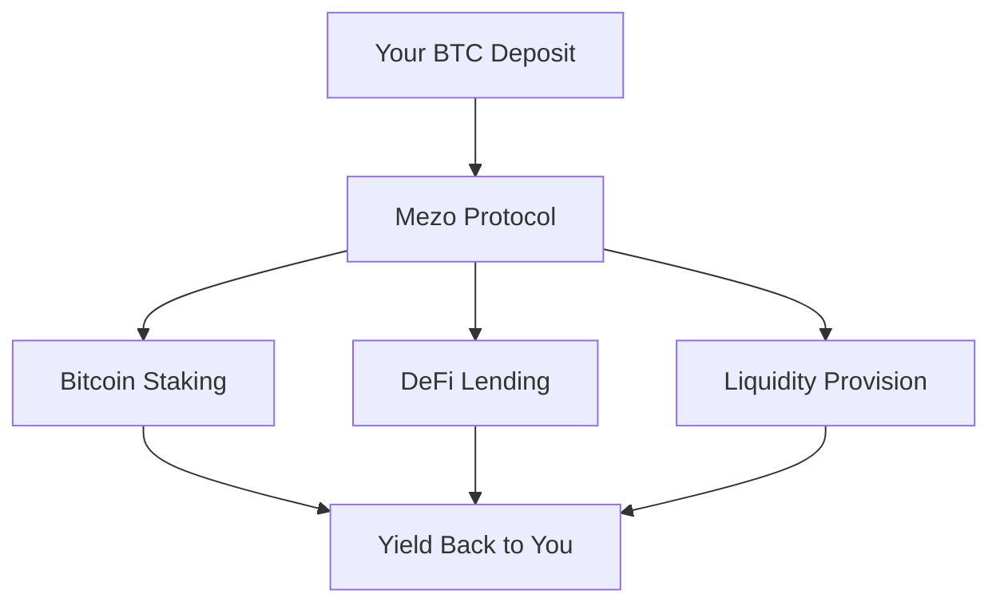

# Earn Your First Yield

Learn how KhipuVault generates yield on your Bitcoin deposits and how to track your earnings effectively.

## Prerequisites

- [First deposit completed](/docs/tutorials/beginner/first-deposit)
- Active balance in an individual savings pool
- At least 24 hours since deposit (to see meaningful yield)

## What You'll Learn

By the end of this tutorial, you will:

- Understand how Bitcoin yield is generated on Mezo
- Calculate your expected earnings
- Track yield in real-time on your dashboard
- Interpret APY vs APR
- Know when and how to claim or compound earnings
- Optimize your yield strategy

## Understanding Bitcoin Yield

### How KhipuVault Generates Yield

Your deposited Bitcoin earns yield through multiple strategies on the Mezo blockchain:



### Yield Sources

1. **Bitcoin Staking**: Your BTC participates in securing the Mezo network
2. **DeFi Lending**: Funds are lent to verified protocols for interest
3. **Liquidity Provision**: Earning fees from decentralized exchange pools
4. **Yield Aggregation**: Automatically optimized across strategies

<Callout type="info">
  **Diversified Strategy**: KhipuVault doesn't rely on a single yield source. This diversification reduces risk while maintaining consistent returns.
</Callout>

## Step 1: View Your Current Yield

### Access Your Dashboard

1. Visit [app.khipuvault.com](https://app.khipuvault.com)
2. Connect your wallet
3. Navigate to "Individual Savings" or "Portfolio" tab

### Dashboard Overview

Your dashboard displays key yield metrics:

```
═══════════════════════════════════════
         INDIVIDUAL SAVINGS
═══════════════════════════════════════
Total Deposited:      0.1 BTC
Yield Earned (24h):   0.00002329 BTC
Total Yield Earned:   0.00008123 BTC
Current Balance:      0.10008123 BTC
Current APY:          8.5%
═══════════════════════════════════════
```

### Understanding the Metrics

**Total Deposited**: Sum of all your deposits minus withdrawals

**Yield Earned (24h)**: Yield accrued in the last 24 hours

**Total Yield Earned**: All-time cumulative yield since first deposit

**Current Balance**: Total Deposited + Total Yield Earned

**Current APY**: Annual Percentage Yield (variable, updates real-time)

## Step 2: Calculate Expected Earnings

### APY vs APR

**APY (Annual Percentage Yield)**: Includes compound interest
- Shows actual return if earnings are reinvested
- Example: 8.5% APY means 8.5% total return over one year with compounding

**APR (Annual Percentage Rate)**: Simple interest only
- Doesn't account for compounding
- Generally lower than APY

<Callout type="info">
  **KhipuVault Uses APY**: Our displayed rates include compounding effects, showing you the true earning potential.
</Callout>

### Manual Calculation

To calculate your expected yield:

**Formula**: `Yield = Principal × APY × Time / 365`

**Example**:
- Principal: 0.1 BTC
- APY: 8.5% (0.085)
- Time: 1 day

```
Daily Yield = 0.1 × 0.085 / 365
            = 0.00002329 BTC per day
```

### Time-Based Projections

For 0.1 BTC at 8.5% APY:

| Period    | Yield (BTC)      | USD Value (@ $100k BTC) |
|-----------|------------------|-------------------------|
| 1 Day     | 0.00002329       | $2.33                   |
| 1 Week    | 0.00016303       | $16.30                  |
| 1 Month   | 0.00070833       | $70.83                  |
| 3 Months  | 0.00212500       | $212.50                 |
| 1 Year    | 0.00885000       | $885.00                 |

<Callout type="success">
  **Compound Power**: With daily compounding, your actual 1-year yield is slightly higher than the simple calculation due to earning yield on yield!
</Callout>

## Step 3: Track Real-Time Earnings

### Live Yield Counter

Your dashboard includes a real-time yield counter:

1. Look for the "Earning Now" indicator
2. Watch your balance increase in real-time
3. Updates occur every block (~12 seconds on Mezo)

### Yield Analytics Chart

1. Navigate to the "Analytics" tab in Individual Savings
2. View your yield growth over time
3. Available chart views:
   - **Daily**: 24-hour yield by hour
   - **Weekly**: Last 7 days of daily yields
   - **Monthly**: 30-day yield history
   - **All-Time**: Complete yield history

### Chart Insights

The analytics chart shows:

- **Blue Line**: Cumulative yield over time
- **Green Bars**: Daily yield amounts
- **Trend Line**: 7-day moving average
- **APY Overlay**: Historical APY changes

## Step 4: Understand Yield Fluctuations

### Why APY Changes

Your APY isn't fixed and fluctuates based on:

1. **Market Conditions**: DeFi lending rates vary with demand
2. **Strategy Allocation**: Automatic rebalancing between yield sources
3. **Network Activity**: Staking rewards based on network participation
4. **Seasonal Trends**: Crypto markets have seasonal patterns

<Callout type="warning">
  **Variable Rates**: The displayed APY is current. Past performance doesn't guarantee future results. Rates can go up or down.
</Callout>

### Historical APY Range

Typical APY ranges for Individual Savings:

- **Minimum**: 5% (during low market activity)
- **Average**: 8-10% (normal conditions)
- **Maximum**: 15% (high demand periods)

### Monitoring Rate Changes

1. Dashboard shows current APY prominently
2. Click "APY History" to see rate changes over time
3. Set up alerts for significant APY changes:
   - Go to Settings → Notifications
   - Enable "APY Change Alerts"
   - Set threshold (e.g., alert if APY drops below 7%)

## Step 5: Compound vs Claim Strategies

### Auto-Compounding (Default)

By default, KhipuVault automatically compounds your yield:

- Earned yield stays in the pool
- Earns additional yield (compound interest)
- No action needed from you
- No gas fees for compounding
- Maximizes long-term growth

**Example of Compound Power**:

Starting with 1 BTC at 10% APY:

| Year | With Compounding | Without Compounding | Difference |
|------|------------------|---------------------|------------|
| 1    | 1.105 BTC        | 1.100 BTC           | +0.005 BTC |
| 2    | 1.221 BTC        | 1.200 BTC           | +0.021 BTC |
| 5    | 1.645 BTC        | 1.500 BTC           | +0.145 BTC |
| 10   | 2.707 BTC        | 2.000 BTC           | +0.707 BTC |

### Manual Claiming (Optional)

If you want to claim yield separately:

1. Navigate to Individual Savings
2. Click "Claim Yield" button
3. Review claimable amount
4. Confirm transaction in MetaMask
5. Yield transfers to your wallet

**When to Claim**:
- You need funds for other purposes
- Want to diversify to other pools
- Prefer separate accounting of principal vs yield

**Costs of Claiming**:
- Gas fee: ~0.0001 BTC per claim
- Stops compounding on claimed amount
- Taxable event (in most jurisdictions)

<Callout type="info">
  **Recommended**: Leave yield to compound for maximum long-term growth. Only claim when you have specific needs for the funds.
</Callout>

## Step 6: Optimize Your Yield

### Strategies to Maximize Earnings

#### 1. Longer Lock Periods

Lock your deposit for higher APY:

```
No Lock:     8.5% APY
30 Days:     9.0% APY  (+0.5%)
90 Days:     10.0% APY (+1.5%)
180 Days:    11.0% APY (+2.5%)
365 Days:    12.5% APY (+4.0%)
```

**Impact on 1 BTC deposit for 1 year**:

- No Lock: 0.085 BTC earned
- 365 Day Lock: 0.125 BTC earned
- **Difference**: +0.04 BTC extra (47% more yield!)

#### 2. Larger Deposits

Some pools offer tiered rates:

- 0.01 - 0.1 BTC: Base APY
- 0.1 - 1 BTC: +0.25% APY
- 1+ BTC: +0.5% APY

#### 3. Community Pools

Join or create community pools for potential APY bonuses:

- Community ROSCAs: 10-12% APY
- Prize Pools: Variable based on lottery structure
- Cooperative Savings: 9-11% APY with social benefits

<Callout type="info">
  **Diversification**: Consider splitting funds across individual and community pools to balance flexibility with yield.
</Callout>

#### 4. Regular Deposits (DCA)

Dollar-cost averaging with regular deposits:

- Set up weekly or monthly deposits
- Smooths out market volatility
- Builds discipline
- Compounds faster with regular additions

### Yield Tracking Spreadsheet

Create your own tracking sheet:

```
Date       | Deposit  | Total Balance | Yield Earned | APY  | Notes
-----------|----------|---------------|--------------|------|-------
2025-01-01 | 0.1      | 0.1           | 0            | 8.5% | Initial
2025-01-08 | 0        | 0.10016       | 0.00016      | 8.5% | Week 1
2025-01-15 | 0.05     | 0.15032       | 0.00032      | 8.7% | Week 2
2025-01-22 | 0        | 0.15065       | 0.00065      | 8.6% | Week 3
```

## Understanding Yield Components

### Breakdown of Your 8.5% APY

Where does the yield come from?

```
Total APY: 8.5%
- Bitcoin Staking:        3.0%
- DeFi Lending:           3.5%
- Liquidity Provision:    2.5%
- Optimization Bonus:    -0.5% (fees)
```

<Callout type="info">
  **Dynamic Allocation**: KhipuVault automatically rebalances between strategies to maximize your yield while managing risk.
</Callout>

### Risk-Adjusted Returns

Different strategies have different risk profiles:

| Strategy              | APY Contribution | Risk Level |
|-----------------------|------------------|------------|
| Bitcoin Staking       | 3.0%             | Very Low   |
| Established DeFi      | 2.5%             | Low        |
| Liquidity Pools       | 2.0%             | Medium     |
| New Protocol Lending  | 1.5%             | Medium-High|

KhipuVault maintains conservative allocation to minimize risk.

## Common Questions

### When will I see my first yield?

**Immediately**, but amounts are small at first:

- **After 1 minute**: ~0.00000004 BTC (for 0.1 BTC deposit)
- **After 1 hour**: ~0.00000097 BTC
- **After 1 day**: ~0.00002329 BTC
- **After 1 week**: ~0.00016303 BTC (noticeable!)

### Why is my yield different from calculated?

Several factors cause variations:

1. **APY Changes**: Rate fluctuates throughout the day
2. **Compounding**: Actual yield slightly higher due to compound interest
3. **Fees**: Performance fee (10%) deducted automatically
4. **Time Precision**: Blockchain timestamps may differ slightly
5. **Rounding**: UI rounds display values

Differences should be minimal (less than 0.1%).

### Is there a maximum yield cap?

No hard cap, but:

- APY naturally limited by market conditions
- Extremely high APYs (greater than 50%) are unsustainable
- KhipuVault targets sustainable 8-15% range
- Conservative strategy prioritizes capital preservation

### Can I lose money?

Risks exist but are managed:

1. **Smart Contract Risk**: Mitigated by audits and insurance
2. **Market Risk**: Bitcoin price volatility (affects USD value, not BTC amount)
3. **Protocol Risk**: Yield strategies could underperform
4. **Impermanent Loss**: Not applicable to staking/lending strategies

Your BTC balance should only grow (never decrease from yield activities).

<Callout type="warning">
  **Important**: While your BTC balance grows, the USD value fluctuates with Bitcoin's market price. A 10% yield gain could be offset by a 15% BTC price drop.
</Callout>

## Troubleshooting

### Yield not showing after 24 hours

**Solutions**:
1. Refresh the page (hard refresh)
2. Check transaction confirmed on block explorer
3. Verify deposit was successful (check Recent Transactions)
4. Clear browser cache
5. Disconnect and reconnect wallet

### Calculated yield doesn't match display

**Reasons**:
1. APY changed during the period
2. Performance fee deducted (10% of yield)
3. Compound interest not accounted for in simple calculation
4. Blockchain time vs wall clock time differences

### APY suddenly dropped

**Common Causes**:
1. Normal market fluctuations
2. Strategy rebalancing in progress
3. DeFi protocol yield changes
4. Temporary during high network congestion

Check APY History to see if it's a temporary dip or trend.

## Next Steps

Now that you understand yield generation:

<Cards>
  <Card
    title="Join a Community Pool"
    href="/docs/tutorials/intermediate/join-rosca"
    description="Explore higher yields through community savings"
  />
  <Card
    title="Maximize Your Yields"
    href="/docs/tutorials/advanced/maximize-yields"
    description="Advanced optimization strategies"
  />
  <Card
    title="Portfolio Management"
    href="/docs/guides/portfolio"
    description="Track and manage multiple positions"
  />
</Cards>

## Additional Resources

- [APY Calculation Deep Dive](/docs/concepts/yield-calculation)
- [Risk Management Guide](/docs/concepts/risk)
- [Tax Implications of Yield](/docs/tutorials/advanced/tax-reporting)
- [Video: Understanding Your Earnings](https://youtube.com/@khipuvault)

<Callout type="success">
  **You're Earning Passive Income!** Your Bitcoin is growing 24/7. Set up recurring deposits to accelerate your wealth building!
</Callout>
