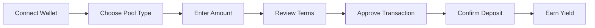

# Make Your First Deposit

Learn how to deposit Bitcoin into KhipuVault and start earning passive yield through Mezo's Bitcoin DeFi protocol.

## Prerequisites

- [Wallet setup complete](/docs/tutorials/beginner/setup-wallet)
- MetaMask connected to Mezo testnet
- Testnet BTC in your wallet (for gas fees)
- 10-15 minutes of time

## What You'll Learn

By the end of this tutorial, you will:

- Understand the deposit process and fees
- Successfully deposit Bitcoin into an individual savings pool
- View your deposit in the dashboard
- Understand when yield starts accruing
- Know how to check your balance and earnings

## Understanding Your First Deposit

### Deposit Flow Overview



### Important Concepts

**Individual Pool**: Your personal savings pool where you earn yield on deposited Bitcoin. Perfect for your first deposit.

**Minimum Deposit**: 0.01 testnet BTC (on mainnet, varies by pool)

**Lock Period**: Optional. Longer locks typically earn higher yields.

**Yield Source**: Earned through Mezo's Bitcoin DeFi protocols (staking, lending)

## Step 1: Navigate to Individual Savings

### Access the App

1. Visit [app.khipuvault.com](https://app.khipuvault.com)
2. Ensure your wallet is connected (address visible in top right)
3. Verify you're on **Mezo Testnet** (check network name in MetaMask)

<Callout type="warning">
  **Network Check**: Always verify you're on the correct network before making deposits. Testnet for testing, Mainnet for real funds.
</Callout>

### Select Individual Savings

1. From the main dashboard, locate the "Individual Savings" card
2. Click "Open Individual Savings" or navigate via the sidebar menu
3. You'll see the Individual Savings interface with:
   - Current balance (0 if new)
   - APY rate display
   - Deposit button

## Step 2: Initiate Deposit

### Start the Deposit Process

1. Click the prominent "Deposit" button
2. A deposit modal will appear with:
   - Amount input field
   - Available balance display
   - Lock period options (optional)
   - Estimated APY based on selections

### Choose Your Amount

1. In the amount field, enter your desired deposit
   - Minimum: 0.01 testnet BTC
   - Use "Max" button to deposit full balance (minus gas)
2. Example: Enter `0.1` for a small test deposit

<Callout type="info">
  **First Deposit Tip**: Start small with your first deposit to understand the process. You can always deposit more later.
</Callout>

### Available Balance

The interface shows:
- **Wallet Balance**: Total testnet BTC in your wallet
- **Available to Deposit**: Wallet balance minus estimated gas fees
- **Already Deposited**: Your current pool balance (0 for first deposit)

## Step 3: Select Lock Period (Optional)

### Understanding Lock Periods

Lock periods are optional commitments that typically earn higher yields:

| Lock Period | APY Boost | When Unlocked |
|-------------|-----------|---------------|
| No Lock     | Base APY  | Anytime       |
| 30 Days     | +0.5%     | 30 days       |
| 90 Days     | +1.5%     | 90 days       |
| 180 Days    | +2.5%     | 180 days      |

<Callout type="info">
  **Flexibility vs. Yield**: No lock means you can withdraw anytime but earn base APY. Locked deposits earn more but can't be withdrawn early.
</Callout>

### Making Your Choice

For your first deposit, we recommend:

1. Select "No Lock" for maximum flexibility
2. Learn the platform before committing to locked deposits
3. You can always create additional locked deposits later

## Step 4: Review Deposit Details

### Transaction Summary

Before confirming, review the summary panel:

```
Deposit Amount:     0.1 testnet BTC
Lock Period:        No Lock
Current APY:        8.5%
Estimated Gas:      ~0.0001 BTC
Total Cost:         0.1001 BTC
```

### Key Information to Verify

- **Deposit Amount**: Matches what you entered
- **Lock Period**: Correct selection (No Lock recommended)
- **APY**: Current yield rate (updates in real-time)
- **Gas Fee**: Network fee for the transaction
- **Total Cost**: Deposit + gas (must have this in wallet)

<Callout type="warning">
  **Double Check**: Review all details carefully. Blockchain transactions are irreversible.
</Callout>

## Step 5: Approve the Transaction

### First Transaction: Token Approval

If this is your first interaction with the pool contract:

1. Click "Approve & Deposit"
2. MetaMask will open with an approval request
3. This grants permission for the contract to interact with your BTC
4. Review the approval details:
   - **Contract Address**: Verify it matches the displayed address
   - **Amount**: Should show your deposit amount or "unlimited"
5. Click "Confirm" in MetaMask
6. Wait for approval transaction to confirm (15-30 seconds)

<Callout type="info">
  **One-Time Approval**: You only need to approve once per token per contract. Future deposits won't require this step.
</Callout>

### Second Transaction: Deposit

After approval confirms:

1. The deposit transaction will automatically trigger
2. MetaMask opens again with the deposit transaction
3. Review the transaction details:
   - **To**: IndividualPool contract address
   - **Amount**: Your deposit amount
   - **Gas Fee**: Network fee
4. Click "Confirm" in MetaMask

### Transaction Confirmation

1. You'll see a "Transaction Submitted" message
2. A transaction hash appears (click to view on block explorer)
3. Wait for confirmation (typically 15-30 seconds on Mezo)
4. Success message appears when complete

<Callout type="success">
  **Transaction Confirmed**: Your Bitcoin is now deposited and earning yield!
</Callout>

## Step 6: Verify Your Deposit

### Check Your Dashboard

After the transaction confirms:

1. The deposit modal closes automatically
2. Your Individual Savings dashboard updates to show:
   - **Total Deposited**: Your deposit amount
   - **Current Balance**: Deposit + any accrued yield
   - **APY**: Your current yield rate
   - **Yield Earned**: Starts at 0, grows over time

### Understanding Your Balance Display

```
Total Deposited:    0.1 BTC
Yield Earned:       0.00000123 BTC (and counting!)
Current Balance:    0.10000123 BTC
APY:                8.5%
```

### View Transaction History

1. Scroll to the "Recent Transactions" section
2. Your deposit appears as the latest entry
3. Click the transaction to view details:
   - Transaction hash
   - Timestamp
   - Amount deposited
   - Gas fee paid
   - Link to block explorer

## Step 7: Track Your Earnings

### When Does Yield Start?

- Yield begins accruing immediately after deposit confirmation
- Updates occur every block (approximately every 12 seconds on Mezo)
- Visible changes may take a few minutes to appear in the UI

### Monitoring Your Growth

1. **Dashboard View**: Check "Yield Earned" on main dashboard
2. **Real-Time Updates**: Balance increases continuously
3. **Daily Summary**: View 24-hour yield in the stats panel
4. **Historical Chart**: Track growth over time in the portfolio tab

<Callout type="info">
  **Compound Growth**: Earned yield automatically compounds, meaning you earn yield on your yield!
</Callout>

### Expected Yield Calculation

For a 0.1 BTC deposit at 8.5% APY:

- **Daily**: 0.1 × 0.085 / 365 = 0.00002329 BTC/day
- **Weekly**: 0.00016303 BTC/week
- **Monthly**: 0.00070833 BTC/month
- **Yearly**: 0.0085 BTC/year

## Common Issues and Solutions

### Transaction Failed

**Problem**: Deposit transaction rejected or failed

**Solutions**:
1. Check you have enough balance for deposit + gas
2. Verify you're on Mezo Testnet
3. Try increasing gas limit in MetaMask advanced settings
4. Check if contract is paused (rare, shown in UI)

### Approval Stuck

**Problem**: Approval transaction pending for long time

**Solutions**:
1. Wait 2-3 minutes (network may be congested)
2. Check transaction on block explorer for status
3. Try canceling and resubmitting with higher gas
4. Refresh page and try deposit again

### Balance Not Updating

**Problem**: Dashboard shows 0 after successful deposit

**Solutions**:
1. Refresh the page (hard refresh: Ctrl+F5 or Cmd+Shift+R)
2. Clear browser cache
3. Disconnect and reconnect wallet
4. Check transaction confirmed on block explorer
5. Wait 1-2 minutes for indexer to update

### Wrong Amount Deposited

**Problem**: Deposited amount differs from expected

**Solutions**:
1. Check transaction details on block explorer
2. Verify no slippage or fees were applied
3. Contact support if discrepancy is significant
4. Note: Small differences may be due to gas estimation

## Understanding Fees

### Gas Fees

- **Approval**: ~0.00005 BTC (one-time)
- **Deposit**: ~0.0001 BTC (per deposit)
- **Total First Deposit**: ~0.00015 BTC

<Callout type="info">
  **Gas Optimization**: Future deposits only pay the deposit gas fee (~0.0001 BTC), not the approval fee.
</Callout>

### Platform Fees

KhipuVault charges minimal fees:

- **Deposit Fee**: 0% (free deposits)
- **Withdrawal Fee**: 0.1% of withdrawn amount
- **Performance Fee**: 10% of earned yield (deducted automatically)

All fees are transparent and displayed before transaction confirmation.

## Security Reminders

### Best Practices

- Verify contract addresses before approving
- Start with small amounts until comfortable
- Never share transaction details that include sensitive info
- Use hardware wallet for large deposits
- Regularly check your balances

### What KhipuVault Can and Cannot Do

**Can**:
- Display your balance
- Request transaction signatures
- Show yield calculations

**Cannot**:
- Access your wallet without approval
- Withdraw funds without your signature
- See your private keys or seed phrase

## Next Steps

Congratulations on your first deposit! Here's what to do next:

<Cards>
  <Card
    title="Earn Your First Yield"
    href="/docs/tutorials/beginner/earn-first-yield"
    description="Learn how to track and understand your earnings"
  />
  <Card
    title="Make Additional Deposits"
    href="/docs/guides/deposits"
    description="Strategies for regular deposits and dollar-cost averaging"
  />
  <Card
    title="Join a Community Pool"
    href="/docs/tutorials/intermediate/join-rosca"
    description="Explore community savings options for higher yields"
  />
</Cards>

## Additional Resources

- [Understanding APY vs APR](/docs/concepts/yield-calculation)
- [Withdrawal Guide](/docs/guides/withdrawals)
- [Portfolio Management](/docs/guides/portfolio)
- [Video Tutorial: First Deposit](https://youtube.com/@khipuvault)

<Callout type="success">
  **You're Earning!** Your Bitcoin is now working for you. Check back tomorrow to see your first day of yield!
</Callout>
