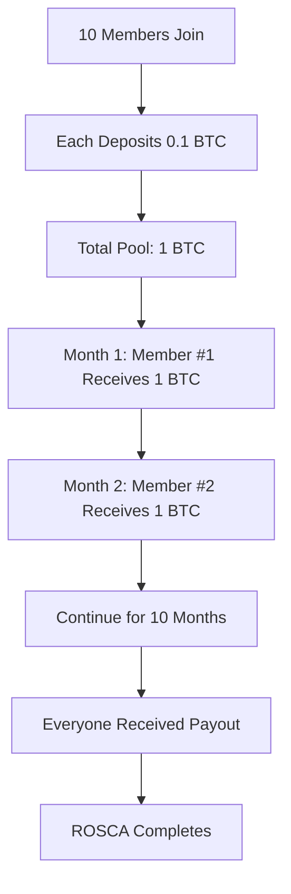

# Join a ROSCA

Learn how to participate in a ROSCA (Rotating Savings and Credit Association), a proven community savings model that combines discipline, trust, and mutual support.

## Prerequisites

- [Wallet setup complete](/docs/tutorials/beginner/setup-wallet)
- Understanding of [community pools](/docs/tutorials/intermediate/create-community-pool)
- Ability to commit to regular deposits
- Minimum 0.05 BTC for entry
- 15-20 minutes of time

## What You'll Learn

By the end of this tutorial, you will:

- Understand how ROSCAs work
- Find and evaluate ROSCA pools
- Successfully join a ROSCA
- Make scheduled deposits on time
- Participate in the rotation system
- Receive your payout when it's your turn
- Manage ROSCA commitments effectively

## Understanding ROSCAs

### What is a ROSCA?

A ROSCA is a traditional savings model adapted for blockchain:

**Traditional ROSCA**: Group of people contribute fixed amounts regularly. Each period, one member receives the total pot. Continues until everyone has received a payout.

**KhipuVault ROSCA**: Same concept, but:
- Transparent on blockchain
- Smart contract enforced
- Earns yield while waiting
- No central administrator needed

### How ROSCAs Work



### Key ROSCA Features

**Fixed Deposits**: Same amount, same schedule (weekly/monthly)

**Rotation Order**: Predetermined or lottery-based

**Accountability**: Smart contract enforces participation

**Yield Bonus**: Funds earn yield while in pool

**No-Loss**: Always get your contributions back + yield

<Callout type="info">
  **ROSCA Benefit**: Forces saving discipline while providing periodic access to lump sums for larger purchases or investments.
</Callout>

## Step 1: Find a ROSCA to Join

### Browse Available ROSCAs

1. Navigate to [app.khipuvault.com/community](https://app.khipuvault.com/community)
2. Click "ROSCAs" tab
3. See list of active and forming ROSCAs

### Filter and Search

Use filters to find suitable ROSCAs:

**By Status**:
- Forming: Still accepting members
- Active: Running, may have slots
- Completed: Ended (view only)

**By Schedule**:
- Weekly deposits
- Bi-weekly deposits
- Monthly deposits

**By Size**:
- Small (5-10 members)
- Medium (10-20 members)
- Large (20+ members)

**By Contribution**:
- Minimum contribution amount
- Total pool size
- Price range

### Evaluate ROSCA Options

Example ROSCA listing:

```
═══════════════════════════════════════════════
          BITCOIN BUILDERS ROSCA
═══════════════════════════════════════════════
Members:           8/12 (4 slots left)
Deposit Amount:    0.05 BTC per month
Duration:          12 months
Total Pot:         0.6 BTC per rotation
Current APY:       9.5%
Rotation Type:     Lottery
Status:            Forming (starts when full)
Created by:        0x7a8b...9c2d (verified)
───────────────────────────────────────────────
Member Requirements:
- Regular monthly deposits
- 7-day grace period for late payments
- 2 missed payments = removal
- Good standing in community

Next Steps:
[View Details] [Join ROSCA]
═══════════════════════════════════════════════
```

### Key Factors to Consider

#### Financial Commitment
- Can you afford the deposit amount?
- Can you commit for the full duration?
- Do you have backup funds for emergencies?

#### Schedule Compatibility
- Does deposit schedule work for you?
- Can you meet deadlines consistently?
- What happens if you're late?

#### Trust & Reputation
- Creator verification status
- Existing member count
- Pool history (if recurring)
- Community feedback

#### Rotation System
- Order determined how? (Lottery, auction, predetermined)
- When might you receive payout?
- Can you request specific position?

<Callout type="warning">
  **Commitment is Key**: Only join a ROSCA if you can commit to ALL deposits. Others depend on you.
</Callout>

## Step 2: Review ROSCA Details

### Deep Dive into Pool Terms

Click "View Details" on a ROSCA to see:

#### Basic Information
- Full pool description
- Creator information
- Creation date
- Smart contract address

#### Financial Terms
```
Contribution:        0.05 BTC
Frequency:           Monthly (1st of month)
Duration:            12 months
Total Contributions: 0.6 BTC (12 × 0.05)
Expected Payout:     0.6 BTC + yield share
Total Pool Value:    7.2 BTC (12 members × 0.6)
```

#### Rules and Penalties
- **On-Time Deposit**: Within 3 days of due date
- **Grace Period**: Additional 4 days with 5% penalty
- **Missed Deposit**: After 7 days, subject to removal
- **Removal**: Forfeit yield, get contributions back

#### Rotation Details
- Order determination (lottery, bid, fixed)
- Payout schedule
- How ties are broken
- Request position option (if available)

### Member List

View current members:
- Wallet addresses (anonymized)
- Join dates
- Deposit history
- Reputation scores (if enabled)

### Smart Contract Verification

Verify the ROSCA smart contract:

1. Click "Contract Details"
2. See contract address
3. Link to block explorer
4. Audit status
5. Verify it's official KhipuVault contract

## Step 3: Join the ROSCA

### Joining Process

1. Click "Join ROSCA" button
2. Join modal appears with summary
3. Review all terms carefully
4. Check acknowledgment boxes:
   - [ ] I understand the commitment
   - [ ] I can afford regular deposits
   - [ ] I accept the rules and penalties
   - [ ] I've reviewed the smart contract

### Position Preference (if applicable)

Some ROSCAs let you indicate position preference:

**Early Position** (1-4):
- Receive payout sooner
- Less total yield earned
- Higher immediate liquidity
- May require higher deposit

**Middle Position** (5-8):
- Balanced timing
- Moderate yield
- Typical choice

**Late Position** (9-12):
- Receive payout last
- Maximum yield earned
- Best long-term returns
- Shows commitment

<Callout type="info">
  **Position Strategy**: Early if you need lump sum soon. Late if maximizing yield. Middle for balance.
</Callout>

### Entry Deposit

Make your entry deposit:

```
Entry Deposit:       0.05 BTC (first contribution)
Joining Fee:         0.001 BTC (one-time)
Estimated Gas:       0.0001 BTC
Total:               0.0511 BTC
```

1. Confirm amounts in modal
2. Click "Join & Deposit"
3. Approve in MetaMask
4. Wait for confirmation

<Callout type="success">
  **You're In!** Welcome to the ROSCA. Your first deposit is complete.
</Callout>

## Step 4: Understand the Schedule

### Your ROSCA Timeline

After joining, view your personalized schedule:

```
═══════════════════════════════════════════════
        YOUR ROSCA SCHEDULE
═══════════════════════════════════════════════
ROSCA:              Bitcoin Builders
Your Position:      #7 of 12
Start Date:         Feb 15, 2025
Your Payout Date:   Aug 15, 2025 (6 months)
───────────────────────────────────────────────
Upcoming Deposits:

✓ Feb 1  - 0.05 BTC (PAID - Entry Deposit)
⏰ Mar 1  - 0.05 BTC (Due in 20 days)
○ Apr 1  - 0.05 BTC
○ May 1  - 0.05 BTC
○ Jun 1  - 0.05 BTC
○ Jul 1  - 0.05 BTC
○ Aug 1  - 0.05 BTC
🎁 Aug 15 - PAYOUT! (~0.6 BTC + yield)
○ Sep 1  - 0.05 BTC (after payout)
○ Oct 1  - 0.05 BTC
○ Nov 1  - 0.05 BTC
○ Dec 1  - 0.05 BTC
○ Jan 1  - 0.05 BTC

Completion:         Jan 15, 2026
═══════════════════════════════════════════════
```

### Calendar Integration

Export to your calendar:

1. Click "Add to Calendar"
2. Choose format (iCal, Google Calendar)
3. Download reminder file
4. Import to your calendar app
5. Set reminders 3 days before each due date

### Enable Notifications

Configure deposit reminders:

1. Go to Settings → Notifications
2. Enable "ROSCA Deposit Reminders"
3. Choose timing:
   - 7 days before
   - 3 days before
   - 1 day before
   - Day of due date
4. Select channels: Email, SMS, Push notification

## Step 5: Make Regular Deposits

### Deposit Workflow

For each scheduled deposit:

#### 7 Days Before
- Receive first reminder notification
- Ensure you have funds in wallet
- Review ROSCA status in dashboard

#### 3 Days Before
- Second reminder notification
- Transfer funds to wallet if needed
- Verify gas fee availability

#### Due Date
- Final reminder notification
- Navigate to ROSCA dashboard
- Click "Make Deposit" for current period
- Confirm transaction in MetaMask

#### Post-Deposit
- Receive confirmation
- See updated status in dashboard
- Your position marked as "Paid" for this period

### Auto-Deposit (Recommended)

Set up automated deposits:

1. Navigate to ROSCA settings
2. Click "Enable Auto-Deposit"
3. Approve smart contract for recurring payments
4. Choose trigger:
   - Auto-deposit on due date
   - Auto-deposit 1 day early
5. Ensure wallet always has sufficient balance

<Callout type="success">
  **Never Miss a Payment**: Auto-deposit removes the mental burden and ensures perfect payment history.
</Callout>

### Late Deposit Process

If you miss the due date:

**Days 1-3 (Grace Period)**:
1. Warning notification sent
2. Make deposit ASAP to avoid penalty
3. Pay regular deposit amount

**Days 4-7 (Penalty Period)**:
1. 5% late fee applies
2. Deposit required: 0.05 BTC + 0.0025 BTC fee = 0.0525 BTC
3. Status marked as "Late"

**After 7 Days**:
1. Risk of removal from ROSCA
2. Member vote or admin decision
3. If removed: Get contributions back (minus yield)

<Callout type="error">
  **Avoid Late Deposits**: Set multiple reminders and consider auto-deposit to maintain good standing.
</Callout>

## Step 6: Monitor ROSCA Progress

### ROSCA Dashboard

Your dashboard shows real-time status:

```
═══════════════════════════════════════════════
     BITCOIN BUILDERS ROSCA - ACTIVE
═══════════════════════════════════════════════
Current Round:       3 of 12
Next Payout:         Mar 15 (Member #3)
Your Position:       #7 (4 months to go)

Your Stats:
Deposits Made:       3/12 (25% complete)
Total Deposited:     0.15 BTC
Yield Earned:        0.0032 BTC
Payment History:     ✓ ✓ ✓ (Perfect!)

Pool Health:
Total Pool Value:    1.92 BTC
Members On-Time:     11/12 (92%)
Average APY:         9.7%
Pool Status:         Healthy ✓
═══════════════════════════════════════════════
```

### Track Other Members

See collective progress:

| Member | Position | Deposits | Status | Last Payment |
|--------|----------|----------|--------|--------------|
| 0x1a2b | #1       | 12/12    | ✓ Complete | Jan 1 |
| 0x3c4d | #2       | 3/3      | ✓ Current | Mar 1 |
| 0x5e6f | #3       | 3/3      | ✓ Current | Mar 1 |
| ...    | ...      | ...      | ...    | ... |
| YOU    | #7       | 3/12     | ✓ Current | Mar 1 |

### Yield Accumulation

Watch your yield grow:

```
Your Yield Breakdown:

From Deposits:       0.0032 BTC
  - Feb deposit (2 mo):  0.0014 BTC
  - Mar deposit (1 mo):  0.0008 BTC
  - Apr deposit (0 mo):  0.0010 BTC

Pool Bonus Yield:    0.0005 BTC
Size Bonus:          0.0003 BTC

Total Yield:         0.0040 BTC
Projected at Payout: ~0.0150 BTC
```

## Step 7: Receive Your Payout

### Payout Notification

When your turn arrives:

1. Notification: "Your ROSCA payout is ready!"
2. Email + in-app alert
3. Dashboard shows "Claim Payout" button

### Payout Details

Review what you'll receive:

```
═══════════════════════════════════════════════
         YOUR ROSCA PAYOUT - READY!
═══════════════════════════════════════════════
Position:            #7 of 12
Payout Date:         Aug 15, 2025

Payout Breakdown:
Your Contributions:  0.35 BTC (7 deposits made)
Pool Contributions:  0.25 BTC (5 from others)
Yield Share:         0.0147 BTC
───────────────────────────────────────────────
TOTAL PAYOUT:        0.6147 BTC

Withdrawal Options:
→ To Wallet:         Receive full amount to wallet
→ Reinvest:          Keep in pool, earn more yield
→ Partial:           Take some, leave some
═══════════════════════════════════════════════
```

### Claim Your Payout

1. Click "Claim Payout"
2. Choose withdrawal option:
   - **Full Withdrawal**: All funds to wallet
   - **Reinvest**: Keep in pool (keeps earning)
   - **Partial**: Specify amount to withdraw
3. Review transaction details
4. Confirm in MetaMask
5. Funds transfer to your wallet

<Callout type="success">
  **Congratulations!** You've received your ROSCA payout. You're now getting early access to pooled funds.
</Callout>

### After Your Payout

**Important**: You still have deposits to make!

- Received payout in month 7
- Still owe deposits for months 8-12
- Continue regular deposits until ROSCA completes
- Your deposits now help later-position members

This is the mutual support aspect of ROSCAs!

## Step 8: Complete the ROSCA

### Final Deposits

After receiving your payout:

1. Continue scheduled deposits
2. Support members in later positions
3. Maintain perfect payment record
4. Build reputation for future ROSCAs

### ROSCA Completion

When final member receives payout:

```
═══════════════════════════════════════════════
    BITCOIN BUILDERS ROSCA - COMPLETED!
═══════════════════════════════════════════════
Duration:            12 months
Total Pool Value:    7.45 BTC
Total Yield:         0.25 BTC
Members Completed:   12/12 (100%)

Your Results:
Contributed:         0.6 BTC
Received:            0.6147 BTC
Net Gain:            0.0147 BTC (2.45% return)
Payment Record:      Perfect (12/12 on-time)

Reputation Earned:   +50 points
Badges:              Perfect Attendance 🏆
═══════════════════════════════════════════════
```

### Join Next Round

Many ROSCAs auto-renew:

1. Option to join Round 2 with same members
2. Better position selection based on round 1 performance
3. Established trust = smoother operation
4. Often higher yields due to larger pool

## Best Practices

### Financial Management

- **Budget Deposits**: Treat as non-negotiable monthly bill
- **Emergency Fund**: Keep separate fund for true emergencies
- **Track Spending**: Ensure ROSCA fits your budget
- **Plan for Payout**: Have plan for lump sum use

### Communication

- **Stay Active**: Participate in ROSCA chat/forum
- **Report Issues**: Inform group immediately if payment problems
- **Support Others**: Help members struggling with deposits
- **Share Success**: Celebrate when members receive payouts

### Building Reputation

- **Perfect Record**: Never miss a payment
- **Early Deposits**: Pay before due date when possible
- **Active Participation**: Engage in governance/discussions
- **Help Onboard**: Assist new members

<Callout type="info">
  **Reputation Matters**: High reputation unlocks larger ROSCAs, better positions, and community trust.
</Callout>

## Common Questions

### What if I can't make a deposit?

1. **Communicate early**: Tell group ASAP
2. **Grace period**: Use 7-day grace period
3. **Borrow**: Consider borrowing from emergency fund
4. **Removal**: Last resort, you get contributions back

### Can I leave a ROSCA early?

**Generally No**, but exceptions:

- Medical emergency
- Job loss
- Other severe hardship

**Process**:
1. Request early exit
2. Member vote required
3. If approved: Receive contributions minus yield
4. Damages reputation

### What if another member doesn't pay?

Smart contract handles it:

1. Member enters grace period
2. If still unpaid after 7 days, member removed
3. Their contributions distributed to active members
4. ROSCA continues with remaining members

### Can I join multiple ROSCAs?

**Yes**, but carefully:

- Ensure you can afford all commitments
- Stagger payout positions across ROSCAs
- Different deposit schedules to spread cash flow
- Track all obligations in calendar

## Troubleshooting

### Deposit Transaction Failed

**Solutions**:
1. Check wallet has sufficient BTC + gas
2. Verify you're on correct network
3. Try increasing gas limit
4. Check ROSCA isn't paused
5. Contact ROSCA admin

### Can't Claim Payout

**Reasons**:
1. Not yet your turn
2. Outstanding deposit obligations
3. Contract issue
4. Already claimed

**Solution**: Check payout schedule and deposit status

### Removed from ROSCA

**What happens**:
- Smart contract returns your contributions
- Forfeit yield earned
- Reputation penalty
- Cannot rejoin this ROSCA

**Next steps**:
- Review what went wrong
- Ensure future commitments are manageable
- Rebuild reputation in smaller ROSCAs

## Next Steps

<Cards>
  <Card
    title="Create Your Own ROSCA"
    href="/docs/guides/create-rosca"
    description="Start a ROSCA for your community"
  />
  <Card
    title="Prize Pool Tutorial"
    href="/docs/tutorials/intermediate/enter-lottery"
    description="Try gamified savings with prize pools"
  />
  <Card
    title="Manage Multiple Pools"
    href="/docs/tutorials/intermediate/manage-multiple-pools"
    description="Balance participation across pools"
  />
</Cards>

## Additional Resources

- [ROSCA Smart Contract](/docs/technical/contracts/rosca)
- [ROSCA History and Culture](/docs/concepts/rosca-origins)
- [Building ROSCA Communities](/docs/guides/community-building)
- [Video: ROSCA Success Stories](https://youtube.com/@khipuvault)

<Callout type="success">
  **Welcome to the ROSCA Community!** You're part of a centuries-old savings tradition, now powered by Bitcoin and blockchain.
</Callout>
