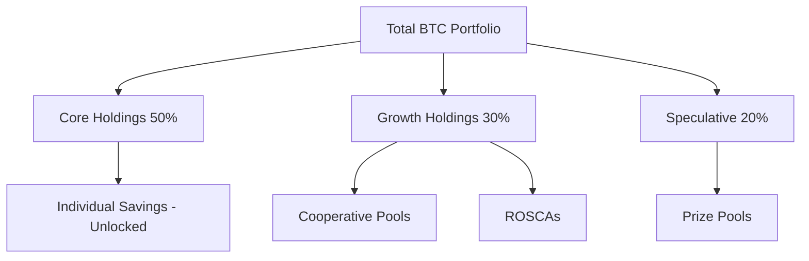

# Manage Multiple Pools

Learn how to effectively manage deposits across individual savings, community pools, ROSCAs, and prize pools to optimize returns while managing risk.

## Prerequisites

- Experience with [individual savings](/docs/tutorials/beginner/first-deposit)
- Understanding of [community pools](/docs/tutorials/intermediate/create-community-pool)
- Familiarity with [ROSCAs](/docs/tutorials/intermediate/join-rosca) or [prize pools](/docs/tutorials/intermediate/enter-lottery)
- At least 0.5 BTC to allocate
- 20-25 minutes of time

## What You'll Learn

By the end of this tutorial, you will:

- Develop a multi-pool allocation strategy
- Use the portfolio dashboard effectively
- Rebalance across pools efficiently
- Track performance across all positions
- Manage cash flow with multiple commitments
- Optimize for different goals (liquidity, yield, community)
- Automate multi-pool management

## Understanding Multi-Pool Strategy

### Why Diversify Across Pools?

Each pool type serves different purposes:

| Pool Type          | Primary Benefit        | Liquidity | Risk  | Yield  |
|--------------------|------------------------|-----------|-------|--------|
| Individual Savings | Flexibility & Control  | High      | Low   | Medium |
| Cooperative Pool   | Community & Higher APY | Medium    | Low   | High   |
| ROSCA              | Discipline & Lump Sum  | Low       | Low   | High   |
| Prize Pool         | Excitement & Jackpots  | High      | Low   | Variable|

<Callout type="info">
  **Diversification Benefits**: Reduce concentration risk, access different yield strategies, maintain liquidity while pursuing higher returns, and enjoy variety.
</Callout>

### Multi-Pool Framework



## Step 1: Assess Your Current Position

### Portfolio Snapshot

First, understand what you currently have:

1. Navigate to [app.khipuvault.com/portfolio](https://app.khipuvault.com/portfolio)
2. View complete holdings across all pools

```
═══════════════════════════════════════════════
           YOUR KHIPUVAULT PORTFOLIO
═══════════════════════════════════════════════
Total Value:         1.5 BTC ($150,000 @ $100k)
24h Change:          +0.0032 BTC (+0.21%)
All-Time Yield:      0.0847 BTC

Holdings Breakdown:
───────────────────────────────────────────────
Individual Savings:  0.8 BTC (53.3%)
- Unlocked:         0.5 BTC
- 90-day lock:      0.2 BTC (45 days left)
- 180-day lock:     0.1 BTC (120 days left)

Community Pools:     0.5 BTC (33.3%)
- Tech Workers:     0.3 BTC (10 members)
- Family Savings:   0.2 BTC (5 members)

ROSCAs:              0.15 BTC (10%)
- Monthly ROSCA:    0.1 BTC (Position #5/12)
- Weekly ROSCA:     0.05 BTC (Position #3/8)

Prize Pools:         0.05 BTC (3.3%)
- Weekly Jackpot:   0.05 BTC (5 tickets)
═══════════════════════════════════════════════
```

### Calculate Liquidity

Understanding what you can access quickly:

**Immediately Available** (0-24 hours):
- Individual savings (unlocked): 0.5 BTC
- Prize pools: 0.05 BTC
- **Total**: 0.55 BTC (36.7%)

**Short-term Accessible** (1-30 days):
- Community pools (with notice): 0.5 BTC
- **Total**: 0.5 BTC (33.3%)

**Locked/Committed** (30+ days):
- Individual locked: 0.3 BTC
- ROSCAs: 0.15 BTC
- **Total**: 0.45 BTC (30%)

<Callout type="warning">
  **Liquidity Rule**: Maintain at least 30% in immediately available funds for emergencies and opportunities.
</Callout>

### Analyze Current Performance

Compare yields across pools:

| Pool                  | Deposit | Current APY | Monthly Yield | Annual Projection |
|-----------------------|---------|-------------|---------------|-------------------|
| Individual (unlocked) | 0.5 BTC | 8.5%        | 0.00354 BTC   | 0.0425 BTC        |
| Individual (90d)      | 0.2 BTC | 10.0%       | 0.00167 BTC   | 0.02 BTC          |
| Individual (180d)     | 0.1 BTC | 11.0%       | 0.00092 BTC   | 0.011 BTC         |
| Tech Workers Pool     | 0.3 BTC | 10.5%       | 0.00263 BTC   | 0.0315 BTC        |
| Family Savings        | 0.2 BTC | 9.8%        | 0.00163 BTC   | 0.0196 BTC        |
| Monthly ROSCA         | 0.1 BTC | 10.2%       | 0.00085 BTC   | 0.0102 BTC        |
| Weekly ROSCA          | 0.05 BTC| 11.5%       | 0.00048 BTC   | 0.00575 BTC       |
| Prize Pool            | 0.05 BTC| 0-?%        | Variable      | Variable          |
| **TOTAL**             | **1.5** | **9.6% avg**| **0.0120 BTC**| **0.144 BTC**     |

## Step 2: Define Your Allocation Strategy

### Identify Your Goals

What are you optimizing for?

#### Goal 1: Maximum Yield
**Allocation**:
- 20% Individual (unlocked) - emergency fund
- 30% Individual (locked) - highest locked rate
- 40% Community pools - community bonus
- 10% ROSCA - disciplined savings

**Expected APY**: ~10.5%

#### Goal 2: Maximum Flexibility
**Allocation**:
- 70% Individual (unlocked) - instant access
- 20% Community pools - short notice
- 10% Prize pools - fun + flexible

**Expected APY**: ~8.8%

#### Goal 3: Balanced Approach (Recommended)
**Allocation**:
- 40% Individual (mix of locked/unlocked)
- 30% Community pools
- 20% ROSCA
- 10% Prize pools

**Expected APY**: ~9.6%

#### Goal 4: Community Builder
**Allocation**:
- 20% Individual (unlocked)
- 50% Community pools (multiple)
- 20% ROSCA
- 10% Prize pools

**Expected APY**: ~10.2% + social benefits

### Set Target Allocation

Choose your strategy and set targets:

```
TARGET ALLOCATION (Balanced Strategy)
═══════════════════════════════════════════════
Total Portfolio:     1.5 BTC

Individual:          0.6 BTC (40%)
- Unlocked:         0.4 BTC (26.7%)
- Locked:           0.2 BTC (13.3%)

Community:           0.45 BTC (30%)
- Cooperative:      0.3 BTC (20%)
- Specialized:      0.15 BTC (10%)

ROSCA:               0.3 BTC (20%)
- Monthly:          0.2 BTC (13.3%)
- Weekly:           0.1 BTC (6.7%)

Prize Pools:         0.15 BTC (10%)
═══════════════════════════════════════════════
```

## Step 3: Rebalance Your Portfolio

### Calculate Required Changes

Compare current vs target:

| Category    | Current | Target  | Difference | Action   |
|-------------|---------|---------|------------|----------|
| Individual  | 0.8 BTC | 0.6 BTC | -0.2 BTC   | Reduce   |
| Community   | 0.5 BTC | 0.45 BTC| -0.05 BTC  | Reduce   |
| ROSCA       | 0.15 BTC| 0.3 BTC | +0.15 BTC  | Increase |
| Prize Pool  | 0.05 BTC| 0.15 BTC| +0.1 BTC   | Increase |

### Execute Rebalancing

#### Step 3a: Withdraw from Over-Allocated Pools

**From Individual Savings**:
1. Navigate to Individual Savings
2. Click "Withdraw"
3. Enter amount: 0.2 BTC
4. Choose source: Unlocked balance (instant)
5. Confirm withdrawal to wallet
6. Wait for confirmation

**From Community Pool**:
1. Navigate to Tech Workers Pool
2. Request withdrawal: 0.05 BTC
3. Wait for notice period (e.g., 48 hours)
4. Claim withdrawal when ready

#### Step 3b: Deposit to Under-Allocated Pools

**Increase ROSCA Allocation**:
1. Find suitable ROSCA (monthly frequency)
2. Join with 0.15 BTC deposit
3. Or increase existing ROSCA position if allowed

**Increase Prize Pool Allocation**:
1. Navigate to Weekly Jackpot
2. Deposit additional 0.1 BTC
3. Receive 10 more tickets

<Callout type="info">
  **Rebalancing Frequency**: Quarterly rebalancing is sufficient. Over-rebalancing wastes gas fees and reduces compounding.
</Callout>

### Rebalancing Calendar

Set reminders:

- **Monthly Review**: Check performance, no action
- **Quarterly Rebalance**: Adjust if greater than 5% drift from target
- **Annual Strategy Review**: Revisit goals and targets

## Step 4: Use the Portfolio Dashboard

### Portfolio Overview

Access comprehensive analytics:

1. Navigate to Portfolio tab
2. View high-level metrics:

```
═══════════════════════════════════════════════
              PORTFOLIO METRICS
═══════════════════════════════════════════════
Total Value:         1.5 BTC
24h Change:          +0.0032 BTC (+0.21%)
7d Change:           +0.0224 BTC (+1.52%)
30d Change:          +0.0963 BTC (+6.87%)

Performance:
Current APY:         9.6% (weighted average)
Target APY:          10.0% (based on allocation)
Actual vs Target:    -0.4% (slightly underperforming)

Diversification Score: 8.5/10 (Excellent)
Liquidity Score:      7/10 (Good)
Risk Score:           3/10 (Low Risk)
═══════════════════════════════════════════════
```

### Visual Analytics

#### Allocation Pie Chart
Visual breakdown of holdings by category and pool

#### Performance Line Chart
Historical total value over time (7d, 30d, 90d, 1y, All)

#### Yield Comparison Bar Chart
Compare yields across all pools side-by-side

#### Allocation vs Target
Donut chart showing current vs target allocation

### Pool-by-Pool Details

Expand each pool for details:

```
▼ TECH WORKERS COOPERATIVE POOL
═══════════════════════════════════════════════
Your Balance:        0.3 BTC
Pool Share:          25% (you own 25% of pool)
Current APY:         10.5%
24h Yield:           0.00086 BTC
All-Time Yield:      0.0142 BTC

Status:              Active ✓
Members:             10/15
Pool Health:         Excellent
Last Activity:       2 hours ago

Quick Actions:
[Deposit More] [Request Withdrawal] [View Pool Details]
═══════════════════════════════════════════════
```

## Step 5: Manage Cash Flow

### Track Upcoming Commitments

Calendar view of all obligations:

```
═══════════════════════════════════════════════
           UPCOMING COMMITMENTS
═══════════════════════════════════════════════
March 2025:
  Mar 1  - Monthly ROSCA deposit:   0.05 BTC ⏰
  Mar 7  - Weekly ROSCA deposit:    0.0125 BTC ⏰
  Mar 15 - Prize Pool drawing:      Win chance!
  Mar 30 - 90-day lock expires:     0.2 BTC unlocks

April 2025:
  Apr 1  - Monthly ROSCA deposit:   0.05 BTC
  Apr 4  - Weekly ROSCA deposit:    0.0125 BTC
  Apr 11 - Weekly ROSCA deposit:    0.0125 BTC
  Apr 15 - ROSCA payout (you):      ~0.6 BTC 🎁
  Apr 18 - Weekly ROSCA deposit:    0.0125 BTC
  Apr 25 - Weekly ROSCA deposit:    0.0125 BTC

Total Obligations (30 days): 0.15 BTC
Expected Inflows:            0 BTC
Net Cash Flow:               -0.15 BTC
═══════════════════════════════════════════════
```

<Callout type="warning">
  **Cash Flow Planning**: Ensure wallet has sufficient BTC to meet all upcoming ROSCA commitments. Missing payments damages reputation.
</Callout>

### Set Up Auto-Funding

Configure automatic wallet funding:

1. Settings → Auto-Funding
2. Set threshold: "Alert when wallet less than 0.1 BTC"
3. Configure auto-withdrawal from unlocked pools
4. Set maximum auto-withdrawal limit

**Example Configuration**:
```
IF wallet balance less than 0.1 BTC
THEN withdraw 0.05 BTC from Individual Savings (unlocked)
TO wallet
Max once per week
```

### Emergency Liquidity Plan

Define priority withdrawal order:

**Tier 1 - Immediate** (0-24 hours):
1. Individual savings (unlocked)
2. Prize pool withdrawals

**Tier 2 - Short Notice** (2-7 days):
3. Community pool withdrawals (with notice)

**Tier 3 - If Absolutely Necessary** (7+ days):
4. Early unlock from locked individual savings (penalty)
5. Exit ROSCA (forfeit yield, reputation damage)

## Step 6: Monitor and Optimize

### Weekly Review Checklist

Every week:

- [ ] Check total portfolio value
- [ ] Review yield generation (on track?)
- [ ] Verify upcoming ROSCA deposits funded
- [ ] Check prize pool drawing results
- [ ] Review any community pool governance items
- [ ] Respond to any pending requests

**Time Required**: 5-10 minutes

### Monthly Deep Dive

Every month:

- [ ] Calculate actual vs expected yields
- [ ] Review allocation drift (greater than 5% from target?)
- [ ] Evaluate pool performance (any underperformers?)
- [ ] Check ROSCA schedules and payout dates
- [ ] Update financial goals if needed
- [ ] Consider new pool opportunities
- [ ] Download transaction history for records

**Time Required**: 20-30 minutes

### Performance Tracking Spreadsheet

Maintain monthly records:

```
Month    | Total | Ind  | Comm | ROSCA| Prize| Yield | APY  | Notes
---------|-------|------|------|------|------|-------|------|-------
Jan 2025 | 1.50  | 0.80 | 0.50 | 0.15 | 0.05 | 0.012 | 9.6% | Initial
Feb 2025 | 1.53  | 0.81 | 0.52 | 0.15 | 0.05 | 0.012 | 9.7% | Slight growth
Mar 2025 | 1.56  | 0.60 | 0.45 | 0.36 | 0.15 | 0.013 | 10.0%| Rebalanced
Apr 2025 | 2.14  | 0.62 | 0.47 | 0.90 | 0.15 | 0.013 | 10.1%| ROSCA payout
```

## Step 7: Advanced Multi-Pool Strategies

### Ladder Strategy

Create maturity ladders for steady access:

**Individual Savings Ladder**:
```
0.1 BTC unlocked    - Immediate access
0.1 BTC 30-day      - Unlocks next month
0.1 BTC 90-day      - Unlocks in 3 months
0.1 BTC 180-day     - Unlocks in 6 months
0.1 BTC 365-day     - Unlocks in 12 months
```

**Benefits**:
- Regular liquidity events
- Maximize locked-rate bonuses
- Smooth cash flow
- Reduce timing risk

### ROSCA Rotation Strategy

Join multiple ROSCAs with staggered positions:

```
ROSCA A (Monthly, 12 members):  Your position #3  → Payout Month 3
ROSCA B (Monthly, 12 members):  Your position #6  → Payout Month 6
ROSCA C (Monthly, 12 members):  Your position #9  → Payout Month 9
ROSCA D (Monthly, 12 members):  Your position #12 → Payout Month 12
```

**Result**: Receive major payout every 3 months!

### Yield Harvesting Strategy

Optimize for short-term yield:

1. **Monitor APY changes** across pools
2. **Move funds** to highest-yielding pools weekly
3. **Accept gas costs** in exchange for yield optimization
4. **Best for**: Large portfolios where gas is less than 0.1% of deposit

**Example**:
- Week 1: Pool A offers 12% APY → Move 0.5 BTC there
- Week 2: Pool B offers 13% APY → Move to Pool B
- Net gain from optimization: ~0.5-1% extra APY

<Callout type="warning">
  **Gas Consideration**: Yield harvesting only makes sense for larger positions. Calculate if extra yield > gas costs.
</Callout>

### Community Pool Portfolio

Become a community pool specialist:

- Join 5-10 different community pools
- Diversify across communities, sizes, purposes
- Learn pool management from different creators
- Build reputation across multiple communities
- Earn community-specific bonuses

## Automation Features

### Auto-Rebalance

Set up automatic rebalancing:

1. Settings → Portfolio Management
2. Enable "Auto-Rebalance"
3. Set rebalance threshold: "When allocation drifts greater than 10%"
4. Set rebalance frequency: "Monthly"
5. Choose rebalance source: Individual savings (unlocked)
6. Set max transaction size: 0.2 BTC per rebalance

### Yield Auto-Compound

Configure yield compounding:

- **Individual Savings**: Auto-compounds by default
- **Community Pools**: Choose "Reinvest" vs "Distribute"
- **Prize Pools**: Auto-reinvest small wins (less than 0.01 BTC)
- **ROSCAs**: Not applicable (yield distributed at payout)

### Smart Notifications

Configure intelligent alerts:

**Performance Alerts**:
- Portfolio underperforming target by greater than 2% for 30 days
- Specific pool underperforming by greater than 3%

**Risk Alerts**:
- Allocation drift greater than 15% from target
- Liquidity below 25%
- Single pool greater than 50% of portfolio

**Opportunity Alerts**:
- New pool with greater than 12% APY available
- Pool you're in has opening for more deposits
- Lock period expiring soon (reinvest opportunity)

## Common Questions

### How many pools is too many?

**Sweet Spot**: 4-6 active pools

**Reasoning**:
- Enough diversification
- Manageable complexity
- Still competitive yields
- Reasonable time commitment

**Maximum**: 10 pools (gets hard to track)

### Should I exit underperforming pools?

**Consider exit if**:
- Pool underperforms by greater than 2% for 90 days
- Better opportunities available
- Pool health deteriorating
- Liquidity needs changed

**Don't exit just because**:
- Short-term underperformance (less than 30 days)
- Minor differences (less than 0.5% APY)
- Market-wide yield drop

### How much in each pool type?

**Conservative**:
- 70% Individual
- 20% Community
- 10% ROSCA/Prize

**Balanced**:
- 40% Individual
- 30% Community
- 20% ROSCA
- 10% Prize

**Aggressive**:
- 20% Individual
- 40% Community
- 30% ROSCA
- 10% Prize

## Troubleshooting

### Can't track all commitments

**Solution**:
- Use portfolio calendar feature
- Export to Google Calendar
- Set up SMS reminders
- Consider reducing pool count

### Frequent rebalancing losing to gas fees

**Solution**:
- Increase rebalance threshold (20%+ drift)
- Rebalance less frequently (quarterly vs monthly)
- Only rebalance large amounts
- Batch multiple rebalances together

### Liquidity crunch

**Prevention**:
- Maintain 30%+ in liquid pools
- Don't over-commit to ROSCAs
- Ladder lock periods
- Keep emergency fund outside KhipuVault

## Next Steps

<Cards>
  <Card
    title="Multi-Pool Strategy"
    href="/docs/tutorials/advanced/multi-pool-strategy"
    description="Advanced portfolio optimization techniques"
  />
  <Card
    title="Maximize Yields"
    href="/docs/tutorials/advanced/maximize-yields"
    description="Yield optimization across all pools"
  />
  <Card
    title="Pool Management"
    href="/docs/tutorials/advanced/pool-management"
    description="Advanced pool administration"
  />
</Cards>

## Additional Resources

- [Portfolio Theory for Crypto](/docs/concepts/portfolio-theory)
- [Risk Management Guide](/docs/concepts/risk-management)
- [Rebalancing Calculator Tool](/docs/tools/rebalancing-calculator)
- [Video: Multi-Pool Management](https://youtube.com/@khipuvault)

<Callout type="success">
  **Congratulations!** You're managing a diversified Bitcoin DeFi portfolio. Regular monitoring and occasional rebalancing will keep you on track to your financial goals.
</Callout>
